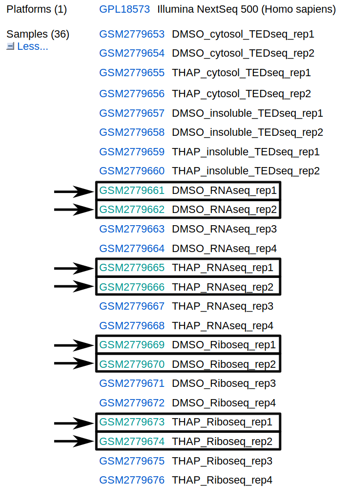

.. _example-workflow:

################
Example workflow
################

The retrieval of input files and running the workflow locally and on a server cluster via a queuing system is demonstrated using an example with data available from SRA via NCBI.
The dataset is available under the GEO accession number *GSE66929*. The retrieval of the data is described in this tutorial.

Setup
=====
First of all, we start by creating the project directory and changing to it.

.. code-block:: bash

    mkdir tutorial; cd tutorial;
	
We then download the lastest version of the *uORF-Tools* into the newly created project folder and unpack it.

.. code-block:: bash

    wget https://github.com/anibunny12/uORF-Tools/archive/1.0.1.tar.gz
    tar -xzf 1.0.1.tar.gz; mv uORF-Tools-1.0.1 uORF-Tools; rm 1.0.1.tar.gz;

Retrieve and prepare input files
================================

Before starting the workflow, we have to acquire and prepare several input files. These files are the annotation file, the genome file, the fastq files, the configuration file and the sample sheet.

Annotation and genome files
***************************
First, we want to retrieve the annotation file and the genome file. In this case we can find both on the `GENCODE <https://www.gencodegenes.org/releases/current.html>`_ :cite:`Gencode` webpage for the human genome.

On this page, we can directly retrieve both files by clicking on the according download links next to the file descriptions. Alternatively, you can directly download them using the following commands:

.. code-block:: bash

    wget ftp://ftp.ebi.ac.uk/pub/databases/gencode/Gencode_human/release_28/gencode.v28.annotation.gtf.gz
    wget ftp://ftp.ebi.ac.uk/pub/databases/gencode/Gencode_human/release_28/GRCh38.p12.genome.fa.gz

Then, we are going to unpack both files.

.. code-block:: bash

    gunzip gencode.v28.annotation.gtf.gz
    gunzip GRCh38.p12.genome.fa.gz
	
Finally, we will rename these files to *annotation.gtf* and *genome.fa*. 

.. code-block:: bash

    mv gencode.v28.annotation.gtf annotation.gtf
    mv GRCh38.p12.genome.fa genome.fa

Another webpage that provides these files is `Ensembl Genomes <http://www.ensembl.org/Homo_sapiens/Info/Index>`_ :cite:`Ensembl:2018`. This usually requires searching their file system in order to find the wanted files. For this tutorial, we recommend to stick to GenCode instead.

Fastq files
***********

Next, we want to acquire the fastq files. For many datasets, the easiest way to retrieve the fastq files is using the `European Nucleotide Archive <https://www.ebi.ac.uk/ena>`_ (ENA) :cite:`SIL:KEA:2017european` as it provides direct download links when searching for a dataset. Unfortunately, the *GSE66929* dataset is not provided by ENA.

Therefore, we will use the `Sequence Read Archive <https://www.ncbi.nlm.nih.gov/sra>`_ (SRA) :cite:`SRA:2011` instead, which is hosted by NCBI.
On the NCBI webpage, we search for the GEO accession number, here *GSE66929*.

.. image:: images/SRA_search.png
    :scale: 50%
    :align: center

We receive one search result. 

When following the link provided in the search results, we get an overview with all kinds of information about the dataset. We are interested mainly in the samples provided on this page. In this tutorial, we are interested in the highlighted samples.

There are many ways to download fastq files with SRA. For more information about downloading please have a look at the following guide: `Downloading SRA data using command line utilities <https://www.ncbi.nlm.nih.gov/books/NBK158899/>`_.

The simplest way is most likely the usage of the `SRA Toolkit <https://trace.ncbi.nlm.nih.gov/Traces/sra/sra.cgi?view=toolkit_doc&f=std>`_, as it allows direct conversion into *.fastq* files.
The figure below shows how to find the *SRR ID* for the example of *C.rna.rep1*. By following the *GSM ID* link (Figure above) and then the *SRX ID* link, the *SRR ID* can be retrieved. 

.. image:: images/SRA_ID.png
    :scale: 50%
    :align: center

Using the *SRA Toolkit* and the *SRR IDs* for our 4 samples we can use the *fasterq-dump* executable to download the according *.fastq* files.
If you already have an installation of the *SRA Toolkit*, you can use the following commands.

.. code-block:: bash

    ./<sraToolkitPath>/bin/fasterq-dump SRR1910466
    gzip SRR1910466.fastq
	
    ./<sraToolkitPath>/bin/fasterq-dump SRR1916542
    gzip SRR1916542.fastq
	
    ./<sraToolkitPath>/bin/fasterq-dump SRR1910470
    gzip SRR1910470.fastq
	
    ./<sraToolkitPath>/bin/fasterq-dump SRR1916548
    gzip SRR1916548.fastq

If you do not have the *SRA Toolkit*, we suggest using a conda environment:

.. code-block:: bash

    conda create -n "sra-tools" -c bioconda -c conda-forge sra-tools
    source activate sra-tools

This will create a conda envrionment and install the sra-tools with all required dependencies. Then you can use the following commands to generate the required *fastq* files.

.. code-block:: bash

    fasterq-dump SRR1910466; gzip SRR1910466.fastq;
    fasterq-dump SRR1916542; gzip SRR1916542.fastq;
    fasterq-dump SRR1910470; gzip SRR1910470.fastq;
    fasterq-dump SRR1916548; gzip SRR1916548.fastq;

.. note:: Ensure that you compress the fastq files. The workflow expects compressed fastq files and it saves a lot of disk space.
.. warning:: **Be advised that the fastq generation step can take several hours depending on the size of the fastq files and your internet connection.**

Now, we create a fastq folder and move all the *.fastq.gz* files into this folder.

.. code-block:: bash

    mkdir fastq; mv *.fastq.gz fastq/;

Configuration file and sample sheet
***********************************

Finally, we will prepare the configuration file (*config.yaml*) and the sample sheet (*samples.tsv*). We start by copying templates for both files from the *uORF-Tools/templates/* into the *uORF-Tools/* folder.

.. code-block:: bash

    cp uORF-Tools/templates/* uORF-Tools/

Using any text editor (vim, nano, gedit, atom, ...), we will first edit the *samples.tsv*.

.. code-block:: bash

    vim uORF-Tools/samples.tsv

The template looks as follows:

+--------+-----------+-----------+--------------------------------+
| method | condition | replicate | fastqFile                      |
+========+===========+===========+================================+
| RIBO   |  A        | 1         | fastq/FP-ctrl-1-2.fastq.gz     |
+--------+-----------+-----------+--------------------------------+
| RIBO   |  B        | 1         | fastq/FP-treat-1-2.fastq.gz    |
+--------+-----------+-----------+--------------------------------+
| RNA    |  A        | 1         | fastq/Total-ctrl-1-2.fastq.gz  |
+--------+-----------+-----------+--------------------------------+
| RNA    |  B        | 1         | fastq/Total-treat-1-2.fastq.gz |
+--------+-----------+-----------+--------------------------------+

• **method** Indicates the method used for this project. RIBO for ribosome profiling or RNA for RNA-seq.
• **condition** Indicates the applied condition (A, B / CTRL, TREAT). Please ensure that you put the control before the treatment alphabetically (e.g. A: Control B: Treatment or CTRL: Control, TREAT: Treatment)
• **replicate** ID used to distinguish between the different replicates (e.g. 1,2, ...)
• **fastqFile** Indicates the according fastq file for a given sample.

For this tutorial, the resulting *samples.tsv* will look as follows:

+--------+-----------+-----------+--------------------------------+
| method | condition | replicate | fastqFile                      |
+========+===========+===========+================================+
| RIBO   |  A        | 1         | fastq/SRR1916542.fastq.gz      |
+--------+-----------+-----------+--------------------------------+
| RIBO   |  B        | 1         | fastq/SRR1916548.fastq.gz      |
+--------+-----------+-----------+--------------------------------+
| RNA    |  A        | 1         | fastq/SRR1910466.fastq.gz      |
+--------+-----------+-----------+--------------------------------+
| RNA    |  B        | 1         | fastq/SRR1910470.fastq.gz      |
+--------+-----------+-----------+--------------------------------+

.. warning:: **Please ensure that you do not replace any tabulator symbols with spaces while changing this file.**

Next, we are going to set up the *config.yaml*.

.. code-block:: bash

    vim uORF-Tools/config.yaml
		
This file contains the following variables:

• **taxonomy** Specify the taxonomic group of the used organism in order to ensure the correct removal of reads mapping to ribosomal genes (Eukarya, Bacteria, Archea).
•	**adapter** Specify the adapter sequence to be used. If not set, *Trim galore* will try to determine it automatically.
•	**samples** The location of the samples sheet created in the previous step.
•	**genomeindexpath** If the STAR genome index was already precomputed, you can specify the path to the files here, in order to avoid recomputation.
•	**uorfannotationpath** If the uORF-file was already precomputed, you can specify the path to the files here, in order to avoid recomputation.

.. code-block:: bash

    #Taxonomy of the samples to be processed, possible are Eukarya, Bacteria, Archea 
    taxonomy: "Eukarya"
    #Adapter sequence used
    adapter: ""
    samples: "uORF-Tools/samples.tsv"
    genomeindexpath: ""
    uorfannotationpath: ""

For this tutorial, we can keep the default values for the *config.yaml*. The organism analyzed in this tutorial is *homo sapiens*, therefore we keep the taxonomy at *Eukarya*. We let *Trim galore* determine the correct adapter sequence. The path to *samples.tsv* is correct and we precomputed nothing, therefore we leave the rest empty.

Running the workflow
====================

Now that we have all the required files, we can start running the workflow, either locally or in a cluster environment.

Run the workflow locally
************************

Use the following steps when you plan to execute the workflow on a single server or workstation. Please be aware that some steps
of the workflow require a lot of memory, specifically for eukaryotic species.

.. code-block:: bash

    snakemake --use-conda -s uORF-Tools/Snakefile --configfile uORF-Tools/config.yaml --directory ${PWD} -j 20 --latency-wait 60

Run Snakemake in a cluster environment
**************************************

Use the following steps if you are executing the workflow via a queuing system. Edit the configuration file *cluster.yaml*
according to your queuing system setup and cluster hardware. The following system call shows the usage with Grid Engine:

.. code-block:: bash

    snakemake --use-conda -s uORF-Tools/Snakefile --configfile uORF-Tools/config.yaml --directory ${PWD} -j 20 --cluster-config uORF-Tools/cluster.yaml

Example: Run Snakemake in a cluster environment
***********************************************

.. warning:: **Be advised that this is a specific example, the required options may change depending on your system.**

We ran the tutorial workflow in a cluster environment, specifically a TORQUE cluster environment. 
Therefore, we created a bash script *torque.sh* in our project folder.

.. code-block:: bash

    vim torque.sh

We proceeded by writing the queueing script:

.. code-block:: bash

    #!/bin/bash
    #PBS -N <ProjectFolder>
    #PBS -S /bin/bash
    #PBS -q "long"
    #PBS -d <PATH/ProjectFolder>
    #PBS -l nodes=1:ppn=1
    #PBS -o <PATH/ProjectFolder>
    #PBS -j oe
    cd <PATH/ProjectFolder>
    source activate snakemake
    snakemake --latency-wait 600 --use-conda -s uORF-Tools/Snakefile --configfile uORF-Tools/config.yaml --directory ${PWD} -j 20 --cluster-config uORF-Tools/torque.yaml --cluster "qsub -N {cluster.jobname} -S /bin/bash -q {cluster.qname} -d <PATH/ProjectFolder> -l {cluster.resources} -o {cluster.logoutputdir} -j oe"

We then simply submitted this job to the cluster:

.. code-block:: bash

    qsub torque.sh

Using any of the presented methods, this will run the workflow on our dataset and create the desired output files.

Report
******

Once the workflow has finished, we can request an automatically generated *report.html* file using the following command:

.. code-block:: bash

    snakemake --latency-wait 600 --use-conda -s uORF-Tools/Snakefile --configfile uORF-Tools/config.yaml --report report.html

References
==========

.. bibliography:: references.bib
