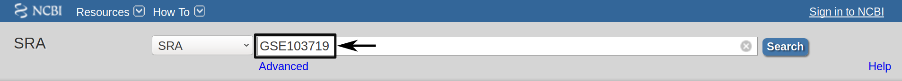
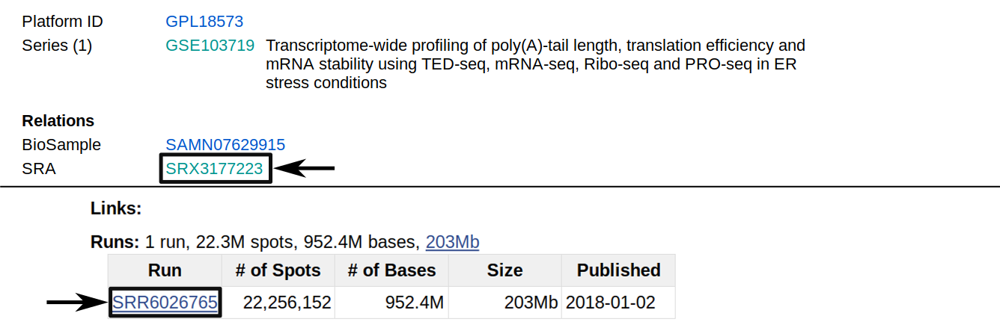

.. _example-workflow:

.. role:: red

################
Example Workflow
################

The retrieval of input files and running the workflow locally and on a server cluster via a queuing system is demonstrated using an example with data available from SRA via NCBI.
The dataset is available under the GEO accession number GSE66929. The retrieval of the data is described in this tutorial.

Setup
=====
First of all, we start by creating the project directory and changing to it.

.. code-block:: bash

    mkdir tutorial; cd tutorial;|
	
We then download the *uORF-Tools* into the newly created project folder.

.. code-block:: bash

    git clone git@github.com:anibunny12/uORF-Tools.git

Retrieve and prepare input files
================================

Before starting the workflow, we have to acquire and prepare several input files. These files are the annotation file, the genome file, the fastq files, the configuration file and the sample sheet.

Annotation and genome files
***************************
First, we want to retrieve the annotation file and the genome file. In this case we can find both on the `GENCODE <https://www.gencodegenes.org/releases/current.html>´_ webpage for the human genome.

.. image:: images/GenCode_download.png
    :scale: 50%
    :align: center

On this page, we can directly retrieve both files by clicking on the according download links next to the file descriptions. Alternatively, you can directly download them using the following commands:

.. code-block:: bash

    wget ftp://ftp.ebi.ac.uk/pub/databases/gencode/Gencode_human/release_28/gencode.v28.annotation.gtf.gz
    wget ftp://ftp.ebi.ac.uk/pub/databases/gencode/Gencode_human/release_28/GRCh38.p12.genome.fa.gz

Then, we are going to decompress both files.

.. code-block:: bash

    gunzip gencode.v28.annotation.gtf.gz
    gunzip GRCh38.p12.genome.fa.gz
	
Finally, we will rename these files to *annotation.gtf* and *genome.fa*. 

.. code-block:: bash

    mv gencode.v28.annotation.gtf annotation.gtf
    mv GRCh38.p12.genome.fa genome.fa

Another webpage that provides these files is `Ensembl Genomes <http://www.ensembl.org/Homo_sapiens/Info/Index>`_. This usually requires searching their file system in order to find the wanted files. For this tutorial, we recommend to stick to GenCode instead.

Fastq files
***********

Next, we want to acquire the fastq files. For many datasets, the easiest way to retrieve the fastq files is using the ´European Nucleotide Archive <https://www.ebi.ac.uk/ena>´_(ENA) as it provides direct download links when searching for a dataset. Unfortunately, the *GSE66929* dataset is not provided by ENA.

Therefore, we will use the ´Sequence Read Archive <https://www.ncbi.nlm.nih.gov/sra>´_(SRA) instead, which is hosted by NCBI.

On the NCBI webpage, we search for the GEO accession number, here *GSE66929*.

.. image:: images/SRA_search_hit.png
    :scale: 50%
    :align: center

We receive one search result. 

.. image:: images/SRA_samples.png
    :scale: 50%
    :align: center

When following the link provided in the search results, we get an overview with all kinds of information about the dataset. We are interested mainly in the samples provided on this page. In this tutorial, we are interested in the highlighted samples.
There are many ways to download fastq files with SRA. For more information about downloading please have a look at the following guide: ´*Downloading SRA data using command line utilities* <https://www.ncbi.nlm.nih.gov/books/NBK158899/>´_.

The simplest way is most likely the usage of the ´*SRA Toolkit* <https://trace.ncbi.nlm.nih.gov/Traces/sra/sra.cgi?view=toolkit_doc&f=std>´_, as it allows direct conversion into *.fast* files.
The figure above shows how to find the *SRR ID* for the example of *C.rna.rep1*. By following the *GSM ID* link and then the *SRX ID* link, the *SRR ID* can be retrieved. 

Using the *SRA Toolkit* and the *SRR ID*s for our 4 samples we can use the *fasterq-dump* executable to download the according *.fastq* files. (We strongly suggest to compress the *.fastq* files in order to save space.)

.. code-block:: bash

    ./<sraToolkitPath>/bin/fasterq-dump SRR1910466
    gzip SRR1910466.fastq
	
    ./<sraToolkitPath>/bin/fasterq-dump SRR1916542
    gzip SRR1916542.fastq
	
    ./<sraToolkitPath>/bin/fasterq-dump SRR1910470
    gzip SRR1910470.fastq
	
    ./<sraToolkitPath>/bin/fasterq-dump SRR1916548
    gzip SRR1916548.fastq
	
:red:´**Be advised that this step can take several hours depending on the size of the fastq files and your internet connection.**´

Now, we create a fastq folder and move all the *.fastq.gz* files into this folder.

.. code-block:: bash

    mkdir fastq; mv *.fastq.gz fastq/;

References
==========

.. bibliography:: references.bib
