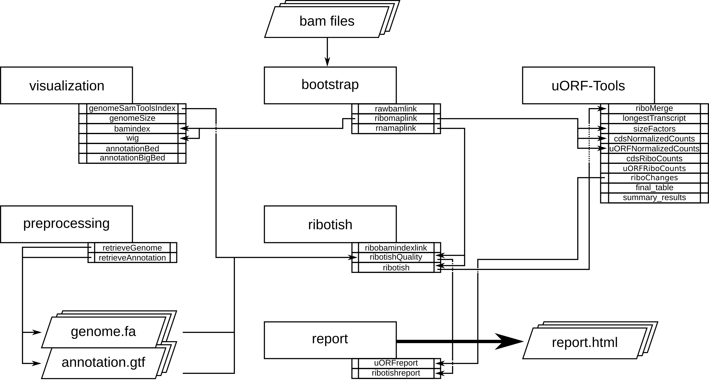

##########
uORF-Tools
##########

Introduction
============

uORF-Tools is a workflow and a collection of tools for the analysis of **Upstream Open Reading Frames** (short uORFs). The workflow is based on the workflow management system **snakemake** and handles installation of all dependencies via `bioconda <https://bioconda.github.io/>`_ :cite:`GRU:KOE:2018`, as well as all processings steps. The source code of uORF-Tools is open source and available under the License. Installation and basic usage is described below.

Program flowchart
=================

The following flowchart describes the processing steps of the workflow and how they are connected.

Directory table
===============

The output is written to a directory structure that corresponds to the workflow steps, you can decide at the bedginning of the workflow whether you want to keep the intermediary files (default) or only the final result.

• | **annotation:** contains the processed user-provided annotation file with genomic features.
  | Contents: *annotation.gtf*

• | **bam:** contains the input *.bam* files.
  | Contents: *<method>-<conditon>-<replicate>.bam*

• | **genomes:** contains the genome file, as well as an according index and sizes file.
  | Contents: *genome.fa*, *genome.fa.fai*, *sizes.genome*

• | **logs:** contains log files for each step of the workflow.
  | Contents: *<rule>.o<jobID>*, *<methods>.log*

• | **maplink:** contains soft links to the *.bam* files and an according index.

	- **RIBO:** contains soft links to the *.bam* and *.bam.bai* files for RIBO and corresponding parameter files (*.para.py*).
  | Contents: *<method-condition-replicate>.bam.bai*, *RIBO/<condition-replicate>.bam.para.py*

• | **report:** contains *.jpg* plots for the *report.html*.
  | Contents: *<condtion-replicate>-qual.jpg*, *xtail_cds_fc.jpg*, *xtail_cds_r.jpg*, *xtail_uORFs_fc.jpg*, *xtail_uORFs_r.jpg*

• | **tracks:** contains *BED (.bed)*, *wig (.wig)* and *bigWig (.bw)* files for visualizing tracks in a genome browser.
  | Contents: *annotation.bb*, *annotation.bed*, *annotation.bed6*, *annotationNScore.bed6*, *annotation-woGenes.gtf*, *<method-condition-replicate>.bw*, *<method-condition-replicate>.wig*

• | **uORFs:** contains the main output of the workflow.

	- **uORFs_regulation.tsv:** table summarizing the predicted uORFs with their regulation on the main ORF.
	- **merged_uORFs.bed:** genome browser track with predicted uORFs.

  | Contents: *longest_protein_coding_transcripts.gtf*, *merged_uORFs.bed*, *merged_uORFs.csv*, *ribo_norm_CDS_reads.csv*, *ribo_norm_uORFs_reads.csv*, *ribo_raw_CDS_reads.csv*, *ribo_raw_uORFs_reads.csv*, *sfactors_lprot.csv*, *uORF_regulation.tsv*

• **uORF-Tools:** contains the workflow tools.

	- **envs:** conda environment files (.yaml).
	- **report:** restructuredText files for the report (.rst).
	- **rules:** the snakemake rules.
	- **schemas:** validation templates for input files
	- **scripts:** scripts used by the snakemake workflow.
	- **templates:** templates for the *config.yaml* and the *samples.tsv*.

Requirements
============

In the following, we describe all the required files and tools needed to run our workflow.

.. note:: For a detailed step by step tutorial of our workflow on a sample dataset, please refer to our :ref:`example-workflow <example-workflow>`.

Tools
=====

miniconda3
**********

As this workflow is based on the workflow management system  `snakemake <https://snakemake.readthedocs.io/en/stable/>`_ :cite:`KOE:RAH:2018Snakemake`.
Snakemake will download all necessary dependencies via `conda <https://conda.io/docs/user-guide/install/index.html>`_.

We strongly recommend installing `miniconda3 <https://conda.io/miniconda.html>`_ with python3.7.

After downloading the miniconda3 version suiting your linux system, execute the downloaded bash file and follow the instructions given.

snakemake
*********

..note:: The uORF-Tools require snakemake (Version >=5.1.3)

The newest version of snakemake can be download via conda using the following command:

.. code-block:: bash

    conda create -c bioconda -c conda-forge -n uORF-Tools snakemake

This creates a new conda environment called "uORF-Tools" and installs snakemake into the environment. The environment can be activated using:

.. code-block:: bash

    source activate uORF-Tools

and deactivated using:

.. code-block:: bash

    source deactivate

uORF-Tools
**********

Using the workflow requires the *uORF-Tools*. The latest version is available on our GitHub page.

In order to run the workflow, we suggest that you download the *uORF-Tools* into your project directory.
The following command creates an example directory and changes into it:

.. code-block:: bash

    mkdir workflow; cd workflow;

Now download and unpack the latest version of the *uORF-Tools* by entering the following commands:

.. code-block:: bash

    wget https://github.com/Biochemistry1-FFM/uORF-Tools/archive/2.0.0.tar.gz
    tar -xzf 2.0.0.tar.gz; mv uORF-Tools-2.0.0 uORF-Tools; rm 2.0.0.tar.gz;

The *uORF-Tools* are now located in a subdirectory of your workflow directory.

Input files
===========

Several input files are required in order to run our workflow, a genome sequence (.fa), an annotation file (.gtf) and the bam files (.fastq).

genome.fa and annotation.gtf
****************************

We recommend retrieving both the genome and the annotation files for mouse and human from `GENCODE <https://www.gencodegenes.org/releases/current.html>`_ :cite:`Gencode` and for other species from `Ensembl Genomes <http://ensemblgenomes.org/>`_ :cite:`Ensembl:2018`.

.. note:: For detailed information about downloading and unpacking these files, please refer to our :ref:`example-workflow <example-workflow>`.

input .bam files
****************

These are the input files provided by you (the user).
Please ensure that you move all input .bam files into a folder called *bam*:

.. code-block:: bash

    mkdir bam
    mv *.bam bam/

sample sheet and configuration file
***********************************

In order to run the *uORF-Tools", you have to provide a sample sheet and a configuration file.
There are templates for both files available in the *uORF-Tools* folder.

Copy the templates of the sample sheet and the configuration file into the *uORF-Tools* folder:

.. code-block:: bash

    cp uORF-Tools/templates/samples.tsv uORF-Tools/
    cp uORF-Tools/templates/config.yaml uORF-Tools/

Customize the *config.yaml* using your preferred editor. It contains the following variables:

• **taxonomy** Specify the taxonomic group of the used organism in order to ensure the correct removal of reads mapping to ribosomal genes (Eukarya, Bacteria, Archea).
•	**adapter** Specify the adapter sequence to be used. If not set, *Trim galore* will try to determine it automatically.
•	**samples** The location of the samples sheet created in the previous step.
•	**genomeindexpath** If the STAR genome index was already precomputed, you can specify the path to the files here, in order to avoid recomputation.
•	**uorfannotationpath** If the uORF-file was already precomputed, you can specify the path to the files here, in order to avoid recomputation.
• **alternativestartcodons** Specify a list of alternative start codons.

Edit the sample sheet corresponding to your project. It contains the following variables:

• **method** Indicates the method used for this project, here RIBO for ribosome profiling.
• **condition** Indicates the applied condition (e.g. A, B, ...).
• **replicate** ID used to distinguish between the different replicates (e.g. 1,2, ...)
• **inputFile** Indicates the according bam file for a given sample.

As seen in the *samples.tsv* template:

+--------+-----------+-----------+--------------------+
| method | condition | replicate | inputFile          |
+========+===========+===========+====================+
| RIBO   |  A        | 1         | bam/FP-treat-1.bam |
+--------+-----------+-----------+--------------------+
| RIBO   |  A        | 2         | bam/FP-treat-2.bam |
+--------+-----------+-----------+--------------------+
| RIBO   |  B        | 1         | bam/FP-ctrl-1.bam  |
+--------+-----------+-----------+--------------------+
| RIBO   |  B        | 2         | bam/FP-ctrl-2.bam  |
+--------+-----------+-----------+--------------------+

.. warning:: **Please make sure that you have at-least two replicates for each condition!**
.. warning:: **Please ensure that you put the treatment before the control alphabetically (e.g. A: Treatment B: Control)**

cluster.yaml
************

In the *uORF-Tools* folder, we provide two cluster.yaml files. Needed by snakemake in order to run on a cluster system:

• sge-cluster.yaml - for grid based queuing systems
• torque-cluster.yaml - for torque based queuing systems

example-workflow
================

A detailed step by step tutorial is available at :ref:`example-workflow <example-workflow>`.

References
==========

.. bibliography:: references.bib
