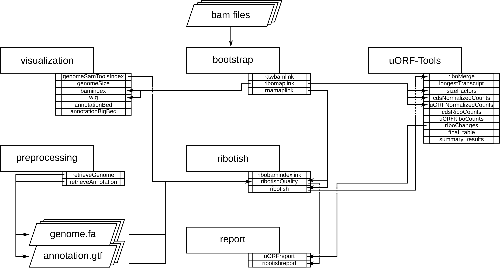

##########
uORF-Tools
##########

Introduction
============

uORF-Tools is a workflow and a collection of tools for the analysis of **Upstream Open Reading Frames** (short uORFs). The workflow is based on the workflow management system **snakemake** and handles installation of all dependencies via `bioconda <https://bioconda.github.io/>`_ :cite:`GRU:KOE:2018`, as well as all processings steps. The source code of uORF-Tools is open source and available under the License **GNU General Public License 3**. Installation and basic usage is described below.

.. note:: For a detailed step by step tutorial of our workflow on a sample dataset, please refer to our :ref:`example-workflow <example-workflow:Example workflow>`.

Program flowchart
=================

The following flowchart describes the processing steps of the workflow and how they are connected:

Directory table
===============

The output is written to a directory structure that corresponds to the workflow steps, you can decide at the beginning of the workflow whether you want to keep the intermediary files (default) or only the final result.

.. image:: images/directoryTable_short.png
    :scale: 35%
    :align: center

• | **annotation:** contains the user-provided annotation file with genomic features.
  | Contents: *annotation.gtf*

• | **bam:** contains the input *.bam* files.
  | Contents: *<method>-<conditon>-<replicate>.bam*

• | **genomes:** contains the genome file, as well as an according index and sizes file.
  | Contents: *genome.fa*, *genome.fa.fai*, *sizes.genome*

• | **logs:** contains log files for each step of the workflow.
  | Contents: *<rule>.o<jobID>*, *<methods>.log*

• | **maplink:** contains soft links to the *.bam* files and an according index.

	- **RIBO:** contains soft links to the *.bam* and *.bam.bai* files for RIBO and corresponding parameter files (*.para.py*).
  | Contents: *<method-condition-replicate>.bam.bai*, *RIBO/<condition-replicate>.bam.para.py*

• | **ribotish:** contains the result files of ribotish.
  | Contents: *<condition-replicate>-newORFs.tsv*, *<condition-replicate>-newORFs.tsv_all.txt*, *<condition-replicate>-qual.txt*, *<condition-replicate>-qual.pdf*

• | **tracks:** contains *BED (.bed)*, *wig (.wig)* and *bigWig (.bw)* files for visualizing tracks in a genome browser.
  | Contents: *annotation.bb*, *annotation.bed*, *annotation.bed6*, *annotationNScore.bed6*, *annotation-woGenes.gtf*, *<method-condition-replicate>.bw*, *<method-condition-replicate>.wig*

• | **uORFs:** contains the main output of the workflow.

	- **uORFs_regulation.tsv:** table summarizing the predicted uORFs with their regulation on the main ORF.
	- **merged_uORFs.bed:** genome browser track with predicted uORFs.

  | Contents: *longest_protein_coding_transcripts.gtf*, *merged_uORFs.bed*, *merged_uORFs.csv*, *ribo_norm_CDS_reads.csv*, *ribo_norm_uORFs_reads.csv*, *ribo_raw_CDS_reads.csv*, *ribo_raw_uORFs_reads.csv*, *sfactors_lprot.csv*, *uORF_regulation.tsv*

• **uORF-Tools:** contains the workflow tools.

	- **comprehensive_annotation:** an example annotation.
	- **envs:** conda environment files (.yaml).
	- **report:** restructuredText files for the report (.rst).
	- **rules:** the snakemake rules.
	- **schemas:** validation templates for input files
	- **scripts:** scripts used by the snakemake workflow.
	- **templates:** templates for the *config.yaml* and the *samples.tsv*.

Output Files
============

This table contains explanations for each of the input/ output files.

+-------------------------------------------+----------------------------------------------------------------------------------------------+
| File name                                 | Description                                                                                  |
+===========================================+==============================================================================================+
| annotation.gtf                            | user-provided annotation file with genomic features                                          |
+-------------------------------------------+----------------------------------------------------------------------------------------------+
| genome.fa                                 | user-provided genome file containing the genome sequence                                     |
+-------------------------------------------+----------------------------------------------------------------------------------------------+
| genome.fa.fai                             | index file of the genome file                                                                |
+-------------------------------------------+----------------------------------------------------------------------------------------------+
| sizes.genome                              | file containing the sizes of each genome sequence in the genome file                         |
+-------------------------------------------+----------------------------------------------------------------------------------------------+
| <method>-<conditon>-<replicate>.bam       | user-provided alignment files (or created using the preprocessing workflow)                  |
+-------------------------------------------+----------------------------------------------------------------------------------------------+
| <method-condition-replicate>.bam.bai      | index file of the alignment files                                                            |
+-------------------------------------------+----------------------------------------------------------------------------------------------+
| <condition-replicate>.bam.para.py         | parameter file generated by RiboTISH                                                         |
+-------------------------------------------+----------------------------------------------------------------------------------------------+
| <methods>.log                             | files containing the process log for each method                                             |
+-------------------------------------------+----------------------------------------------------------------------------------------------+
| <condition-replicate>-newORFs.tsv         | RiboTISH output file containing newly discovered ORFs (significant only)                     |
+-------------------------------------------+----------------------------------------------------------------------------------------------+
| <condition-replicate>-newORFs.tsv_all.txt | RiboTISH output file containing newly discovered ORFs (all)                                  |
+-------------------------------------------+----------------------------------------------------------------------------------------------+
| <condition-replicate>-qual.txt            |                                                                                              |
+-------------------------------------------+----------------------------------------------------------------------------------------------+
| <condition-replicate>-qual.pdf            |                                                                                              |
+-------------------------------------------+----------------------------------------------------------------------------------------------+
| annotation.bb                             |                                                                                              |
+-------------------------------------------+----------------------------------------------------------------------------------------------+
| annotation.bed                            |                                                                                              |
+-------------------------------------------+----------------------------------------------------------------------------------------------+
| annotation.bed6                           |                                                                                              |
+-------------------------------------------+----------------------------------------------------------------------------------------------+
| annotationNScore.bed6                     |                                                                                              |
+-------------------------------------------+----------------------------------------------------------------------------------------------+
| annotation-woGenes.gtf                    |                                                                                              |
+-------------------------------------------+----------------------------------------------------------------------------------------------+
| <method-condition-replicate>.bw           |                                                                                              |
+-------------------------------------------+----------------------------------------------------------------------------------------------+
| <method-condition-replicate>.wig          |                                                                                              |
+-------------------------------------------+----------------------------------------------------------------------------------------------+
| uORFs_regulation.tsv                      |                                                                                              |
+-------------------------------------------+----------------------------------------------------------------------------------------------+
| merged_uORFs.bed                          |                                                                                              |
+-------------------------------------------+----------------------------------------------------------------------------------------------+
| merged_uORFs.csv                          |                                                                                              |
+-------------------------------------------+----------------------------------------------------------------------------------------------+
| longest_protein_coding_transcripts.gtf    |                                                                                              |
+-------------------------------------------+----------------------------------------------------------------------------------------------+
| ribo_norm_CDS_reads.csv                   |                                                                                              |
+-------------------------------------------+----------------------------------------------------------------------------------------------+
| ribo_norm_uORFs_reads.csv                 |                                                                                              |
+-------------------------------------------+----------------------------------------------------------------------------------------------+
| ribo_raw_CDS_reads.csv                    |                                                                                              |
+-------------------------------------------+----------------------------------------------------------------------------------------------+
| ribo_raw_uORFs_reads.csv                  |                                                                                              |
+-------------------------------------------+----------------------------------------------------------------------------------------------+
| sfactors_lprot.csv                        |                                                                                              |
+-------------------------------------------+----------------------------------------------------------------------------------------------+
| uORF_regulation.tsv                       |                                                                                              |
+-------------------------------------------+----------------------------------------------------------------------------------------------+

Tool Parameters
===============

Special characters and versions used for the most important tools. Standard input/output parameters were omitted.

+---------------------------+-------------+--------------------------------------------------------------------------------------------------------------------------------------------------+
| Tool                      | Version     | Special parameters used                                                                                                                          |
+===========================+=============+==================================================================================================================================================+
| riboTISH                  | 0.2.1       | --longest (-v -p -b -g -f)                                                                                                                       |
+---------------------------+-------------+--------------------------------------------------------------------------------------------------------------------------------------------------+
| trim-galore               | 0.5.0       | --phred33 -q 20 --length 15 --trim-n --suppress_warn --clip_R1 1 --dont_gzip                                                                     |
+---------------------------+-------------+--------------------------------------------------------------------------------------------------------------------------------------------------+
| star                      | 2.6.1b      | --genomeDir genomeStarIndex --outSAMtype BAM SortedByCoordinate --outSAMattributes All --outFilterMultimapNmax 1 --alignEndsType Extend5pOfRead1 |
+---------------------------+-------------+--------------------------------------------------------------------------------------------------------------------------------------------------+
| sortmerna                 | 2.1b        | -m 4096 -a --ref <dbstring> --reads --num_alignments 1 --fastx --aligned --other                                                                 |
+---------------------------+-------------+--------------------------------------------------------------------------------------------------------------------------------------------------+
| fastqc                    | 0.11.8      |                                                                                                                                                  |
+---------------------------+-------------+--------------------------------------------------------------------------------------------------------------------------------------------------+
| imagemagick               | 7.0.8_15    | -density 150 -trim -quality 100 -flatten -sharpen 0x1.0                                                                                          |
+---------------------------+-------------+--------------------------------------------------------------------------------------------------------------------------------------------------+

Requirements
============

In the following, we describe all the required files and tools needed to run our workflow.

Tools
=====

miniconda3
**********

As this workflow is based on the workflow management system  `snakemake <https://snakemake.readthedocs.io/en/stable/>`_ :cite:`KOE:RAH:2018Snakemake`, **Snakemake** will download all necessary dependencies via `conda <https://conda.io/projects/conda/en/latest/user-guide/install/index.html>`_.

We strongly recommend installing `miniconda3 <https://conda.io/miniconda.html>`_ with **python3.7**.

After downloading the **miniconda3** version suiting your linux system, execute the downloaded bash file and follow the instructions given.

snakemake
*********

.. note:: The uORF-Tools require snakemake (version==5.4.5)

The newest version of snakemake can be downloaded via conda using the following command:

.. code-block:: bash

    $ conda create -c conda-forge -c bioconda -n snakemake snakemake==5.4.5

This creates a new conda environment called **snakemake** and installs **snakemake** into the environment. The environment can be activated using:

.. code-block:: bash

    $ conda activate snakemake

and deactivated using:

.. code-block:: bash

    $ conda deactivate

uORF-Tools
**********

Using the workflow requires the **uORF-Tools**. The latest version is available on our GitHub page.

In order to run the workflow, we suggest that you download the **uORF-Tools** into your project directory.
The following command creates an example directory and changes into it:

.. code-block:: bash

    $ mkdir project
    $ cd project

Now, download and unpack the latest version of the **uORF-Tools** by entering the following commands:

.. code-block:: bash

   $ wget https://github.com/Biochemistry1-FFM/uORF-Tools/archive/3.1.1.tar.gz
   $ tar -xzf 3.1.1.tar.gz; mv uORF-Tools-3.1.1 uORF-Tools; rm 3.1.1.tar.gz;

The **uORF-Tools** are now a subdirectory of your project directory.

Input files
===========

Several input files are required in order to run our workflow, a genome sequence (.fa), an annotation file (.gtf) and the bam files (.bam).

genome.fa and annotation.gtf
****************************

We recommend retrieving both the genome and the annotation files for mouse and human from `GENCODE <https://www.gencodegenes.org/human/>`_ :cite:`Gencode` and for other species from `Ensembl Genomes <http://ensemblgenomes.org/>`_ :cite:`Ensembl:2018`.

.. note:: For detailed information about downloading and unpacking these files, please refer to our :ref:`example-workflow <example-workflow:Example workflow>`.

input .bam files
****************

These are the input files provided by you (the user).

"For best performance, reads should be trimmed (to ~ 29 nt RPF length) and aligned to genome using end-to-end mode (no soft-clip). Intron splicing is supported. Some attributes are needed such as NM, NH and MD. For STAR, `--outSAMattributes All` should be set. bam file should be sorted and indexed by samtools." (RiboTISH requirements, see `https://github.com/zhpn1024/ribotish <https://github.com/zhpn1024/ribotish>`_ ).

Please ensure that you move all input *.bam* files into a folder called **bam** (Located in your project folder):

.. code-block:: bash

    $ mkdir bam
    $ cp *.bam bam/

Sample sheet and configuration file
***********************************

In order to run the **uORF-Tools**, you have to provide a sample sheet and a configuration file.
There are templates for both files available in the **uORF-Tools** folder.

Copy the templates of the sample sheet and the configuration file into the **uORF-Tools** folder:

.. code-block:: bash

    $ cp uORF-Tools/templates/samples.tsv uORF-Tools/
    $ cp uORF-Tools/templates/config.yaml uORF-Tools/

Customize the **config.yaml** using your preferred editor. It contains the following variables:

• **taxonomy** Specify the taxonomic group of the used organism in order to ensure the correct removal of reads mapping to ribosomal genes (Eukarya, Bacteria, Archea). (Option for the preprocessing workflow)
•	**adapter** Specify the adapter sequence to be used. If not set, *Trim galore* will try to determine it automatically. (Option for the preprocessing workflow)
•	**samples** The location of the samples sheet created in the previous step.
•	**genomeindexpath** If the STAR genome index was already precomputed, you can specify the path to the files here, in order to avoid recomputation. (Option for the preprocessing workflow)
•	**uorfannotationpath** If a uORF-annotation file was already pre-computed, you can specify the path to the file here. Please make sure, that the file has the same format as the uORF_annotation_hg38.csv file provided in the git repo (i.e. same number of columns, same column names)
• **alternativestartcodons** Specify a comma separated list of alternative start codons.

Edit the sample sheet corresponding to your project. It contains the following variables:

• **method** Indicates the method used for this project, here RIBO for ribosome profiling.
• **condition** Indicates the applied condition (e.g. A, B, ...).
• **replicate** ID used to distinguish between the different replicates (e.g. 1,2, ...)
• **inputFile** Indicates the according bam file for a given sample.

As seen in the *bam-samples.tsv* template:

+-----------+-----------+-----------+------------------+
|   method  | condition | replicate | inputFile        |
+===========+===========+===========+==================+
| RIBO      |  A        | 1         | bam/RIBO-A-1.bam |
+-----------+-----------+-----------+------------------+
| RIBO      |  A        | 2         | bam/RIBO-A-2.bam |
+-----------+-----------+-----------+------------------+
| RIBO      |  A        | 3         | bam/RIBO-A-3.bam |
+-----------+-----------+-----------+------------------+
| RIBO      |  A        | 4         | bam/RIBO-A-4.bam |
+-----------+-----------+-----------+------------------+
| RIBO      |  B        | 1         | bam/RIBO-B-1.bam |
+-----------+-----------+-----------+------------------+
| RIBO      |  B        | 2         | bam/RIBO-B-2.bam |
+-----------+-----------+-----------+------------------+
| RIBO      |  B        | 3         | bam/RIBO-B-3.bam |
+-----------+-----------+-----------+------------------+
| RIBO      |  B        | 4         | bam/RIBO-B-4.bam |
+-----------+-----------+-----------+------------------+

.. warning:: **Please make sure that you have at-least two replicates for each condition!**
.. warning:: **Please ensure that you put the treatment before the control alphabetically (e.g. A: Treatment B: Control)**

cluster.yaml
************

In the **template** folder, we provide two cluster.yaml files needed by snakemake in order to run on a cluster system:

• **sge-cluster.yaml** - for grid based queuing systems
• **torque-cluster.yaml** - for torque based queuing systems

Example-workflow
================

A detailed step by step tutorial is available at: :ref:`example-workflow <example-workflow:Example workflow>`.

Preprocessing-workflow
=================

We also provide an preprocessing workflow containing a preprocessing step, starting with fastq files.
A detailed step by step tutorial is available at: :ref:`preprocessing-workflow <preprocessing-workflow:Preprocessing workflow>`.

References
==========

.. bibliography:: references.bib
