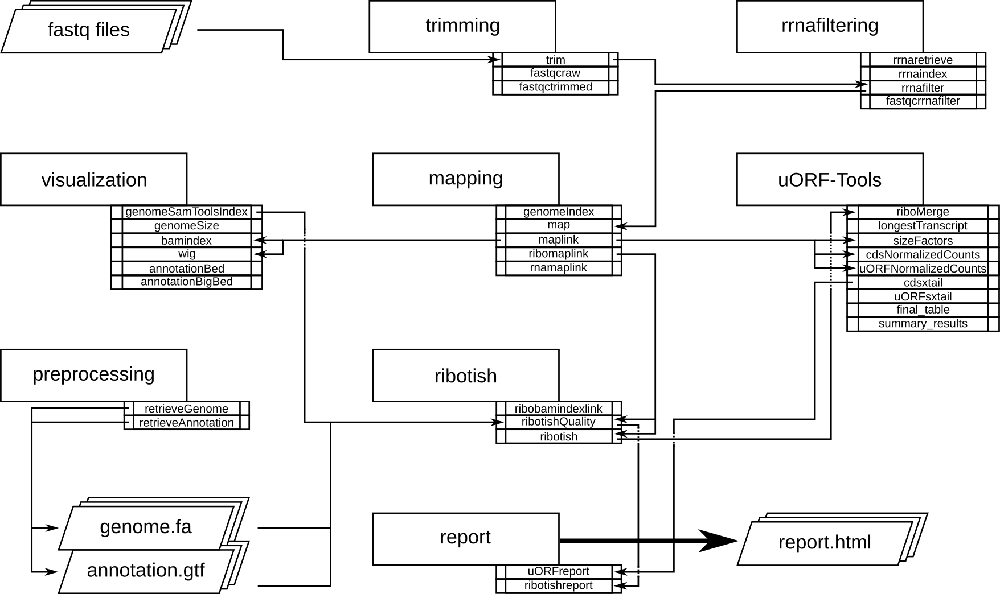

########################
uORF-Tools Documentation
########################
Introduction
============

uORF-Tools are a workflow and a collection of tools for the analysis of **Upstream Open Reading Frames** (short uORFs). The workflow is based on the workflow management system snakemake and handles installation of all dependencies via `bioconda <https://bioconda.github.io/>`_ :cite:`GRU:KOE:2018`, as well as all processings steps. The source code of uORF-Tools is open source and available under the License. Installation and basic usage is described below.

Program flowchart
=================

The following flowchart describes the processing steps of the workflow and how they are connected. there is a variant of the workflow accepting a preprocessed uORF-annotation file, to skip the time consuming ribotish step for reruns of the workflow.

Directory table
===============

The output is written to a directory structure that corresponds to the workflow steps, you can decide at the bedginning of the workflow if you want to keep the intermediary files (default) or only the final result.
.. TODO ADD TABLE

**MISSING TABLE**

Installation
============

We recommend to install *uORF-Tools* with all dependencies via conda. Once you have `conda <https://conda.io/docs/user-guide/install/index.html>`_ installed simply type:

.. code-block:: bash

    conda create -c bioconda -c conda-forge -n uORF-Tools snakemake
    source activate uORF-Tools

Usage
=====

Using the workflow requires the *uORF-Tools*, a genome sequence (.fasta), an annotation file (.gtf) and the sequencing results files (.fastq). We recommend retrieving both the genome and the annotation files for mouse and human from `Gencode <https://www.gencodegenes.org/releases/current.html>`_ :cite:`Gencode` and for other species from `Ensembl Genomes <http://ensemblgenomes.org/>`_ :cite:`SIL:KEA:2017european`. The usage of the workflow is first described in general, while a detailed example applied to an example dataset is described here: :ref:`example-workflow <example-workflow>`.

Retrieve uORF-Tools
===================

The first step is downloading the latest version of *uORF-Tools* from Github. Open your terminal and create a new directory for your workflow and change into it.

.. code-block:: bash

    mkdir uORFflow; cd uORFflow;

(All following commands assume that you are located in the workflow folder)
Now download *uORF-Tools* by entering the following command:

.. code-block:: bash

    git clone git@github.com:anibunny12/uORF-Tools.git

The *uORF-Tools* are now located in a subdirectory of your workflow.

Prepare input files
===================

If the genome and the annotation file are compressed, extract them using *gunzip* or any other decompression tool.

.. code-block:: bash

    gunzip <genomeFile>.fa.gz
    gunzip <annotationFile>.gtf.gz
	
Copy or move the genome and the annotation file into the workflow folder and name them *genome.fa* and *annotation.gtf*.

.. code-block:: bash

    mv <genomeFile>.fa genome.fa
    mv <annotationFile>.gtf annotation.gtf

Create a folder *fastq/* and copy your fastq files into the folder. Name the files according to a METHOD-CONDITION-SAMPLEID.fastq scheme (e.g. Total-ctrl-1.fastq)

.. code-block:: bash

    mkdir fastq
    cp <fastqFile>.fastq fastq/<Method-Condition-SampleID>.fastq
	
Now copy the templates of the sample sheet and the configuration file into the *uORF-Tools* folder.

.. code-block:: bash

    cp uORF-Tools/templates/samples.tsv uORF-Tools/
    cp uORF-Tools/templates/config.yaml uORF-Tools/

Next, customize the *config.yaml*. It contains the following variables:

• **taxonomy** Specify the taxonomic group of the used organism in order to ensure the correct removal of reads mapping to ribosomal genes (Eukarya, Bacteria, Archea).
•	**adapter** Specify the adapter sequence to be used. If not set, \textit{Trim galore} will try to determine it automatically.
•	**samples** The location of the samples sheet created in the previous step.
•	**genomeindexpath** If the STAR genome index was already precomputed, you can specify the path to the files here, in order to avoid recomputation.
•	**uorfannotationpath** If the uORF-file was already precomputed, you can specify the path to the files here, in order to avoid recomputation.
 
Now edit the sample sheet corresponding to your project. It contains the following variables:

• **method** Indicates the method used for this project. RIBO for ribosome profiling or RNA for RNA-seq.
• **condition** Indicates the applied condition (A, B / CTRL, TREAT). Please ensure that you put the control before the treatment alphabetically (e.g. A: Control B: Treatment or CTRL: Control, TREAT: Treatment)
• **replicate** ID used to distinguish between the different replicates (e.g. 1,2, ...)
• **fastqFile** Indicates the according fastq file for a given sample.

As seen in the *samples.tsv* template:
  
+-----------+-----------+-----------+--------------------------------+
|   method  | condition | replicate | fastqFile                      |
+===========+===========+===========+================================+
| RIBO      |  A        | 1         | fastq/FP-ctrl-1-2.fastq.gz     |
+-----------+-----------+-----------+--------------------------------+
| RIBO      |  B        | 1         | fastq/FP-treat-1-2.fastq.gz    |
+-----------+-----------+-----------+--------------------------------+
| RNA       |  A        | 1         | fastq/Total-ctrl-1-2.fastq.gz  |
+-----------+-----------+-----------+--------------------------------+
| RNA       |  B        | 1         | fastq/Total-treat-1-2.fastq.gz |
+-----------+-----------+-----------+--------------------------------+

Executing the workflow
======================

The workflow will first retrieve all required programs and install them. Then it will derive the necessary computation step depending on your input files.
You will receive continuous updates about the progress of the workflow execution. Log files of the individual steps will be written to the logs subdirectory and are named according to the workflow step. 
The intermediary output of the different workflow steps are written to directories as shown in the directory table.

Run the workflow locally
************************
Use the following steps when you plan to execute the workflow on a single server or workstation. Please be aware that some steps
of the workflow require a lot of memory, specifically for eukaryotic species. In our tests with the human genome the memory
consumption did not exceed xxGB. .. TODO **MISSING INFORMATION**

.. code-block:: bash

    snakemake --use-conda -s uORF-Tools/Snakefile --configfile uORF-Tools/config.yaml --directory ${PWD} -j 20 --latency-wait 60

Run Snakemake in a cluster environment
**************************************
Use the following steps if you are executing the workflow via a queuing system. Edit the configuration file cluster.yaml
according to your queuing system setup and cluster hardware. The following system call shows the usage with Grid Engine:

.. code-block:: bash

    snakemake --use-conda -s uORF-Tools/Snakefile --configfile uORF-Tools/config.yaml --directory ${PWD} -j 20 --cluster-config uORF-Tools/cluster.yaml

References
==========

.. bibliography:: references.bib
